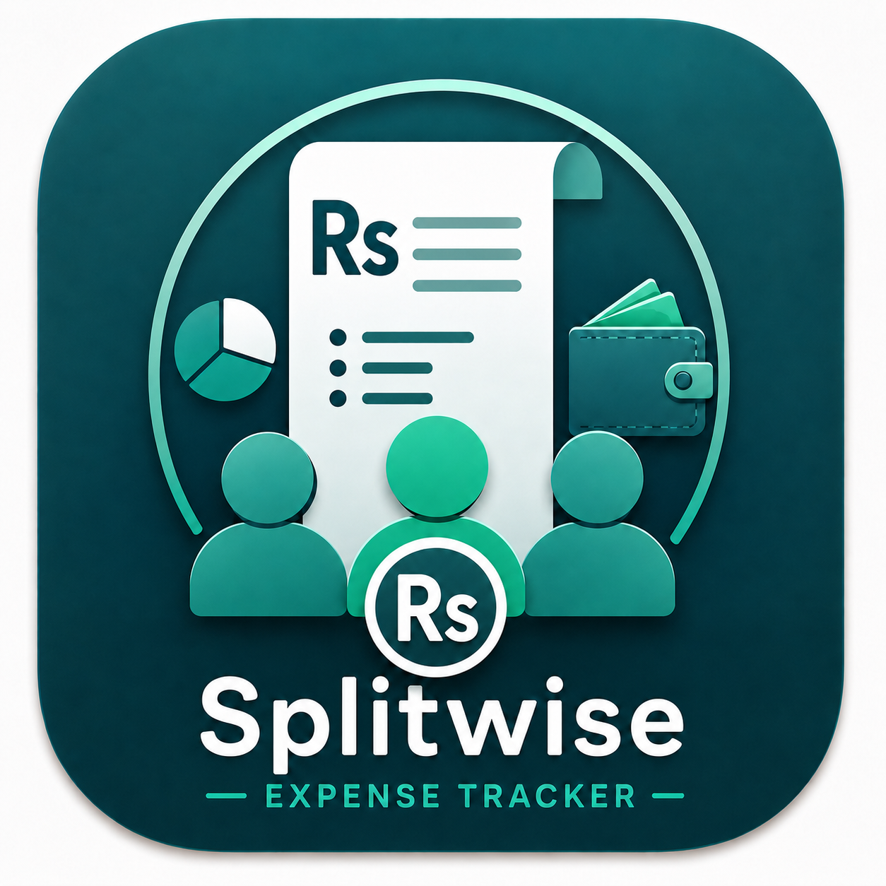

Splitwise Expense Tracker

Offline-first personal finance + shared expense management in Flutter

  <strong>Track.</strong>
  <strong>Budget.</strong>
  <strong>Analyze.</strong>
  <strong>Split.</strong>
  <strong>Settle.</strong>

  
  
  
  
  
  
  

  A polished, production-oriented expense management application built with
  <strong>Flutter</strong>, <strong>Riverpod</strong>, and <strong>Isar Community</strong>.
  Designed for personal finance, budgeting, analytics, group expense sharing,
  debt settlement, PDF reporting, multi-currency defaults, and offline-first use.

✨ Why this project stands out

<table>
  <tr>
    <td width="33%" valign="top">
      <h3>💸 Personal Finance</h3>
      

        Record daily expenses, organize them by category, filter history,
        manage weekly/monthly budgets, and review financial progress.
      

    </td>
    <td width="33%" valign="top">
      <h3>👥 Shared Expenses</h3>
      

        Create groups, add members, split shared expenses fairly,
        calculate balances, and record settlement payments.
      

    </td>
    <td width="33%" valign="top">
      <h3>📊 Analytics</h3>
      

        Understand spending patterns through category breakdowns,
        income-vs-expense charts, budget health, and monthly summaries.
      

    </td>
  </tr>
</table>

🖥️ Product Preview

<table>
  <tr>
    <td align="center">
      <strong>Financial Overview</strong> 
      
    </td>
    <td align="center">
      <strong>Expenses</strong> 
      
    </td>
  </tr>
  <tr>
    <td align="center">
      <strong>Analytics</strong> 
      
    </td>
    <td align="center">
      <strong>Groups</strong> 
      
    </td>
  </tr>
  <tr>
    <td align="center">
      <strong>Group Details</strong> 
      
    </td>
    <td align="center">
      <strong>Settings</strong> 
      
    </td>
  </tr>
</table>

Add screenshots to docs/screenshots/ using the filenames above.

🚀 Core Features

<table>
  <tr>
    <td valign="top" width="50%">

💳 Personal Expenses

Add, edit, and delete expenses

Category-based organization

Search expenses by title

Filter by category

Weekly and monthly filters

Sort by newest / oldest

Sort by highest / lowest amount

Currency-aware expense records

🎯 Budgets & Categories

Weekly spending budgets

Monthly spending budgets

Budget progress tracking

Remaining-budget calculation

Warning threshold

Danger threshold

Custom category management

Protected default categories

📈 Analytics

Weekly expense summary

Weekly income summary

Monthly expense summary

Monthly income summary

Monthly net position

Category-spending pie chart

Income-vs-expense comparison

Currency-isolated analytics

🤝 Shared Expense Groups

Create groups

Add and remove members

Record shared expenses

Equal split

Precise minor-unit rounding

Net balance calculation

Settlement suggestions

Partial settlement payments

Settlement history

</table>

💱 Multi-Currency Default

The app supports a persisted default currency setting.

Currency

Name

PKR

Pakistani Rupee

USD

US Dollar

GBP

British Pound

EUR

Euro

AED

UAE Dirham

SAR

Saudi Riyal

How it works

Changing the default currency affects:

new personal expenses

new budgets

new groups

dashboard currency views

analytics currency views

Existing financial records are not converted, relabeled, or rewritten.

The application intentionally does not perform live FX conversion in v1.0.

🧠 Financial Logic

All monetary values are stored and calculated using integer minor units.

This avoids floating-point precision issues.

Example

PKR 3,000 paid by A
Participants: A, B, C

Equal share = PKR 1,000 each

Resulting balances:

A  +PKR 2,000
B  -PKR 1,000
C  -PKR 1,000

Suggested settlements:

B -> A  PKR 1,000
C -> A  PKR 1,000

The settlement engine uses a greedy debt simplification strategy to reduce unnecessary transfers.

🧱 Architecture

The project follows Feature-First Clean Architecture.

lib/
├── app/
│   └── app.dart
│
├── core/
│   ├── constants/
│   ├── currency/
│   ├── db/
│   ├── errors/
│   ├── theme/
│   └── utils/
│
├── features/
│   ├── analytics/
│   │   ├── domain/
│   │   └── presentation/
│   │
│   ├── dashboard/
│   │   └── presentation/
│   │
│   ├── expenses/
│   │   ├── data/
│   │   ├── domain/
│   │   └── presentation/
│   │
│   ├── group_splits/
│   │   ├── data/
│   │   ├── domain/
│   │   └── presentation/
│   │
│   ├── home/
│   │   └── presentation/
│   │
│   └── settings/
│       └── presentation/
│
└── main.dart

packages/
└── local_database/
    └── lib/

Architectural goals

clear separation of concerns

testable domain logic

isolated persistence layer

reusable presentation components

scalable feature organization

offline-first behavior

maintainable production code

🛠️ Technology Stack

Layer

Technology

Framework

Flutter

Language

Dart

State Management

Riverpod

Database

Isar Community

Charts

fl_chart

PDF Reports

pdf + printing

Architecture

Feature-First Clean Architecture

UI

Material 3

Testing

flutter_test + integration_test

Platforms

Android, iOS, Windows/Desktop

🎨 UI & UX

The interface is designed as a professional finance workspace rather than a demo application.

Desktop

responsive left sidebar

overview workspace

professional KPI cards

expense tables

responsive analytics

dedicated settings navigation

wide group details layout

Mobile

bottom navigation

compact cards

responsive forms

scroll-safe screens

fixed primary save actions

touch-friendly controls

Appearance

Light mode

Dark mode

System theme

Material 3 visual language

Restrained enterprise finance palette

Semantic colors for success, warning, danger, and information

⚙️ Settings

The Settings workspace contains real interactive functionality.

<table>
  <tr>
    <td><strong>💱 Default Currency</strong></td>
    <td>Choose the default currency used by new financial records.</td>
  </tr>
  <tr>
    <td><strong>🎨 Appearance</strong></td>
    <td>Switch between system, light, and dark modes.</td>
  </tr>
  <tr>
    <td><strong>🎯 Budgets & Categories</strong></td>
    <td>Manage budget limits and expense categories.</td>
  </tr>
  <tr>
    <td><strong>💾 Data & Storage</strong></td>
    <td>Inspect the local application-data location.</td>
  </tr>
  <tr>
    <td><strong>📄 Reports</strong></td>
    <td>Open groups and export PDF reports.</td>
  </tr>
  <tr>
    <td><strong>ℹ️ About</strong></td>
    <td>View application and technology information.</td>
  </tr>
</table>

📄 PDF Reports

Group PDF reports can include:

group information

group members

shared expenses

net balances

settlement suggestions

PDF support is implemented using:

pdf
printing

💾 Offline-First Persistence

The application works without requiring a cloud connection.

Data is stored locally with Isar Community.

Persisted data includes:

personal expenses

categories

budgets

groups

members

shared expenses

settlement payments

The default currency preference is also persisted locally.

🧪 Quality & Testing

The project includes automated validation across multiple layers.

Unit Tests

Business logic such as:

equal split calculation

balance calculation

debt settlement calculation

budget progress

analytics logic

Repository / Persistence Tests

Validate:

expense persistence

budget persistence

group persistence

Isar repository behavior

Widget Tests

Validate key UI behavior and persisted data rendering.

Integration Test

The end-to-end integration flow verifies:

Launch application
        ↓
Open Groups
        ↓
Create group
        ↓
Open Group Details
        ↓
Add shared expense
        ↓
Save transaction
        ↓
Verify persisted transaction

Verification commands

flutter analyze
flutter test -j 1
flutter test integration_test/app_test.dart

🏁 Getting Started

1. Clone the repository

git clone https://github.com/HuzaifaaNadeem/Splitwise-Expense-Tracker.git
cd Splitwise-Expense-Tracker

2. Install packages

flutter pub get

3. Verify Flutter

flutter doctor

⚡ Code Generation

Riverpod

Run from the project root:

dart run build_runner build --delete-conflicting-outputs

Isar

Run inside the local database package:

cd packages/local_database
dart run build_runner build --delete-conflicting-outputs
cd ../..

▶️ Run the Application

Windows

flutter run -d windows

Android

flutter run

Available devices

flutter devices

✅ Release Verification

Before publishing a release:

dart format lib integration_test test
flutter analyze
flutter test -j 1
flutter test integration_test/app_test.dart

🗺️ Roadmap

<strong>Click to view future improvements</strong>

 

Exact split UI

Percentage split UI

Weighted-share split UI

Encrypted backup and restore

CSV export

Spreadsheet export

Authentication

Cloud synchronization

Live foreign-exchange conversion

Multi-device synchronization

Recurring expenses

Financial goals

Notifications and reminders

📸 Recommended Portfolio Screenshots

For a strong GitHub / LinkedIn presentation, capture:

<table>
  <tr>
    <td>01</td>
    <td><strong>Financial Overview</strong></td>
    <td>KPI cards, budget health, recent expenses</td>
  </tr>
  <tr>
    <td>02</td>
    <td><strong>Expenses</strong></td>
    <td>Search, filters, sorting, transaction table</td>
  </tr>
  <tr>
    <td>03</td>
    <td><strong>Analytics</strong></td>
    <td>Pie chart, income-vs-expense chart, summary cards</td>
  </tr>
  <tr>
    <td>04</td>
    <td><strong>Groups</strong></td>
    <td>Professional group workspace</td>
  </tr>
  <tr>
    <td>05</td>
    <td><strong>Group Details</strong></td>
    <td>Balances, settlements, shared expenses</td>
  </tr>
  <tr>
    <td>06</td>
    <td><strong>Settings</strong></td>
    <td>Default currency and appearance controls</td>
  </tr>
  <tr>
    <td>07</td>
    <td><strong>Dark Mode</strong></td>
    <td>Show responsive visual polish</td>
  </tr>
</table>

📌 Project Status

✅ Version 1.0.0

Core functionality complete · Tests passing · Desktop runtime verified

🤝 Contributing

Contributions, ideas, and improvements are welcome.

Suggested workflow:

git checkout -b feature/your-feature
git add .
git commit -m "feat: add your feature"
git push origin feature/your-feature

Then open a Pull Request.

🔒 Privacy

This application is designed as an offline-first finance tool.

Financial data remains on the user's device unless future cloud features are explicitly added.

📜 License

Before commercial distribution or public release, add a suitable license based on the intended usage model.

For an open-source project, common choices include:

MIT

Apache 2.0

GPLv3

For proprietary/commercial distribution, use an appropriate commercial license instead.

⭐ Built with Flutter

  Designed as a portfolio-quality, offline-first finance application with
  clean architecture, persistent local storage, automated testing,
  responsive UI, and practical expense-sharing workflows.

  <strong>Track smarter. Split fairly. Settle clearly.</strong>

 

